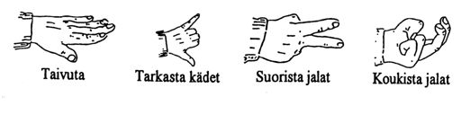

# t18 FS-hyppääminen. (Formation skydive, flätsi, RW / relative works…)

---
template: default

## Koulutusohjelma

- Koulutusohjelman mukaan oppilaan tulee hypätä vähintään **5 ryhmähyppyä**.

- Ohjelma tarjoaa yhdeksän erilaista hyppyohjelmaa/suunnitelmaa.

- **Tavoite** on oppia saapumaan muodostelmaan ja ottamaan ote:

  -   tavoite 1 pysymään samalla tasolla

  -   tavoite 2 oppia liikkumaan eteen ja taakse, ylös ja alas

  -   tavoite 3 ottamaan ote

  -   tavoite 4 oppia tekemään käännöksiä 90-360 -astetta.

---

## Turvallisuus

-   Turvallisuusasiat korostuvat, koska mukana on useita hyppääjiä
    lähellä toisiaan.

-   Uloshyppy on aina suunniteltava ja harjoiteltava lentokoneella
    tai uloshyppysimulaattorilla.

-   Hypyn kulku on harjoiteltava laudoilla ja pystyssä (kuivat).

--

-   **Jos uloshyppy epäonnistuu, on kaikkien tiedettävä mitä
    silloin tehdään. Tästä pitää sopia etukäteen.**

--

-   .red.bold[Vapaapudotuksessa on vaarana, että joudutaan toisen hyppääjän ala-
    tai yläpuolelle. -&gt; Ilma ei kanna ja hyppääjä putoaa
    toisen päälle.]

---

## II Turvallisuus

-   Hypyn purkaminen oikeassa korkeudessa on **oppilaan tehtävä.**

-   Hyvä pureva ja suunnassa pysyvä liuku korostuu.

-   On aina oltava varautunut väistämään heti avauksen jälkeen (viedään
    kädet takimmaisille kantohihnoille heti varjon avautumisen jälkeen).

-   Suunniteltu ja ennakoitava varjolla lentely antaa muille
    mahdollisuuden ennakoida.

---

## Käsimerkit

Kouluttaja voi antaa NOVA-tasoilta tuttuja käsimerkkejä:
.center[]
.center[]

---

template: title2

